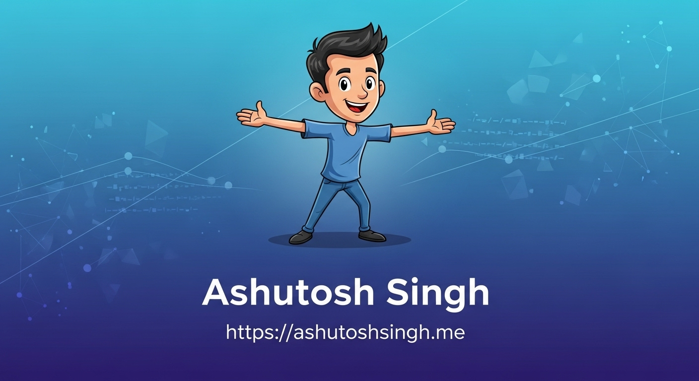

  

<h1 align="center">Ashutosh Singh</h1>
<h3 align="center">Software Engineer | Backend & DSA Focused</h3>

  
  
  
  

---

## 🧠 About Me

I am an aspiring **Software Engineer** with a strong foundation in  
**Data Structures & Algorithms**, backend development, and problem-solving.

I enjoy building **clean, efficient backend systems** and actively contributing to
open-source communities while strengthening my core CS fundamentals.

- 🔧 **Languages:** Python, C++, JavaScript  
- 🌐 **Frontend:** React, Tailwind CSS  
- 🗄️ **Backend:** REST APIs, PostgreSQL, SQLAlchemy  
- 🤖 **Machine Learning:** Fundamentals & applied projects  
- 📍 **Intern:** *NMS Softwares & Innovations India Pvt Ltd*  
- 📧 **Email:** ashutoshsingh6376@gmail.com  

---

## 💻 Languages & Usage

| Language | Primary Use |
|--------|-------------|
| **C++** | Data Structures & Algorithms |
| **Python** | Backend Development, Machine Learning |
| **JavaScript** | Frontend Development |

---

## 🧠 Core Skills

- ✅ Data Structures & Algorithms  
- ✅ Backend Development (REST APIs)  
- ✅ Database Design (PostgreSQL, SQLAlchemy)  
- ✅ Frontend Basics (React, Tailwind CSS)  
- ✅ Machine Learning Fundamentals  

---

## 🌍 Open Source Contributions

- 🟢 **GirlScript Summer of Code (GSSoC)** Contributor  
- ✅ **26+ Pull Requests merged** across multiple repositories  
- 🔧 Contributions include bug fixes, feature implementations, and code improvements  
- 📌 All contributions are publicly visible in my **GitHub Pull Requests history**

👉 You can explore my open-source work here:  
🔗 **GitHub Pull Requests:** https://github.com/pulls?q=is%3Apr+author%3Aashutosh-engineer

---

## 🏆 Achievements

- 🥇 **Vadodara Hackathon 6.0 – Winner**  
  🔗 [View LinkedIn Post](https://www.linkedin.com/posts/ashutosh-singh-7945812b2_vadodarahackathon-hackathonwinner-teamechelon-activity-7377302932041551872-kXsw)

- 🏅 **Vadodara Hackathon 5.0 – Finalist**

- 🥇 **PU Code Hackathon 2.0 – Winner**  
  🔗 [View LinkedIn Post](https://www.linkedin.com/posts/ashutosh-singh-7945812b2_hackathon-pucodehackathon-paruluniversity-activity-7280561628167786496-8ecS)

---

## 🔗 Profiles & Competitive Programming

  
  

---

## 📬 Let's Connect

  
  
  

---

  🚀 <i>Focused on strong fundamentals, real-world impact, and meaningful open-source contributions.</i>

